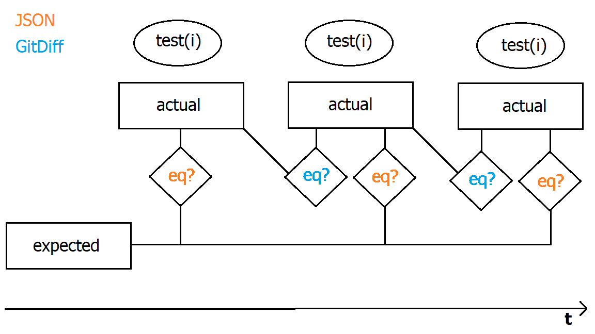
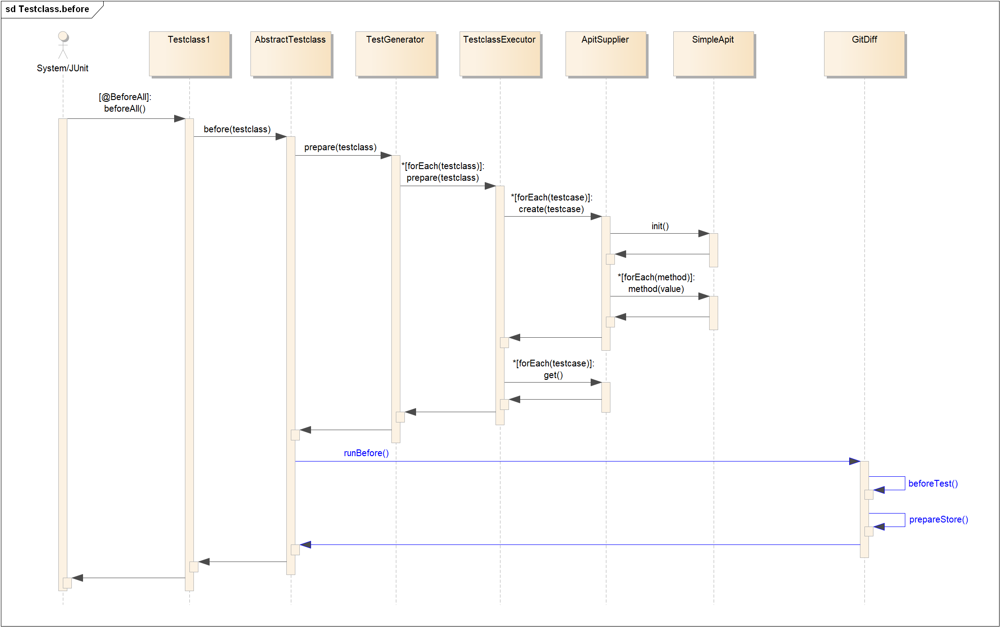
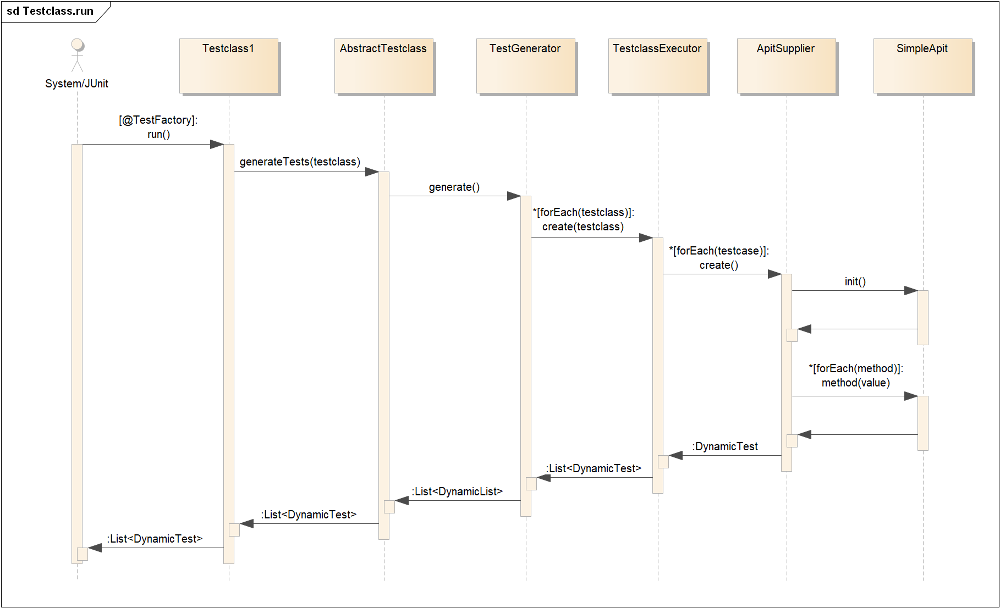
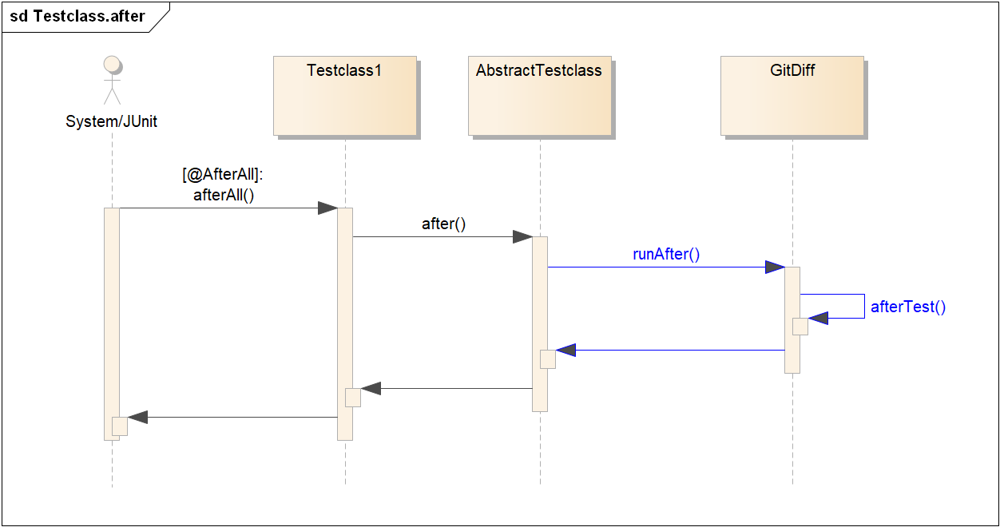
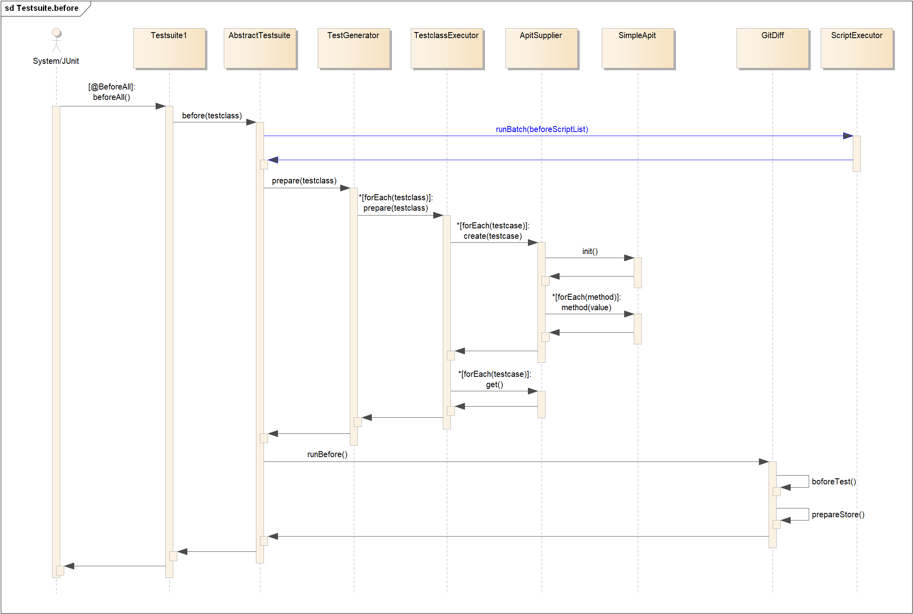
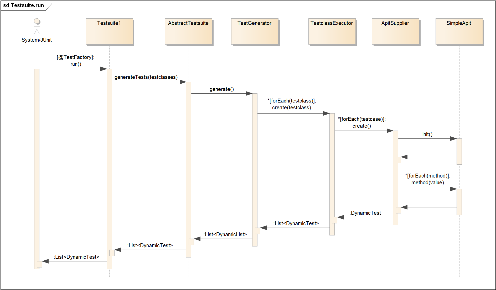
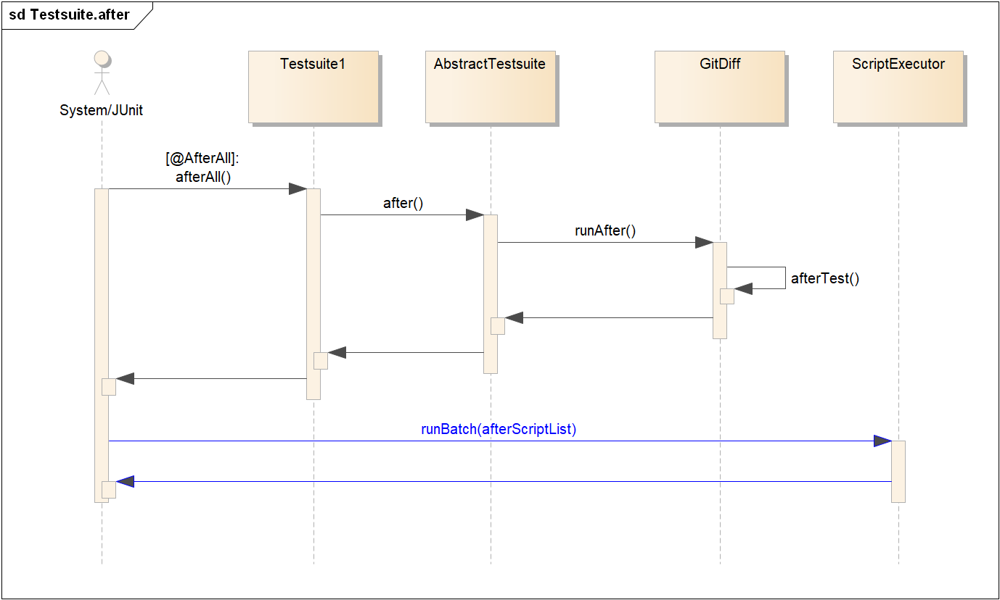
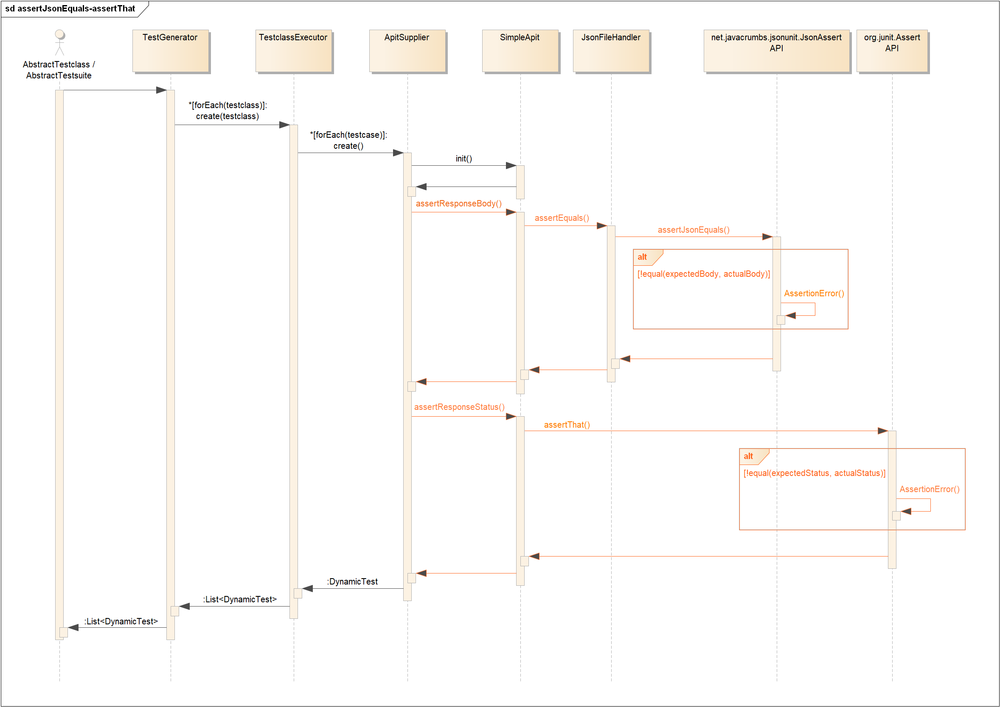
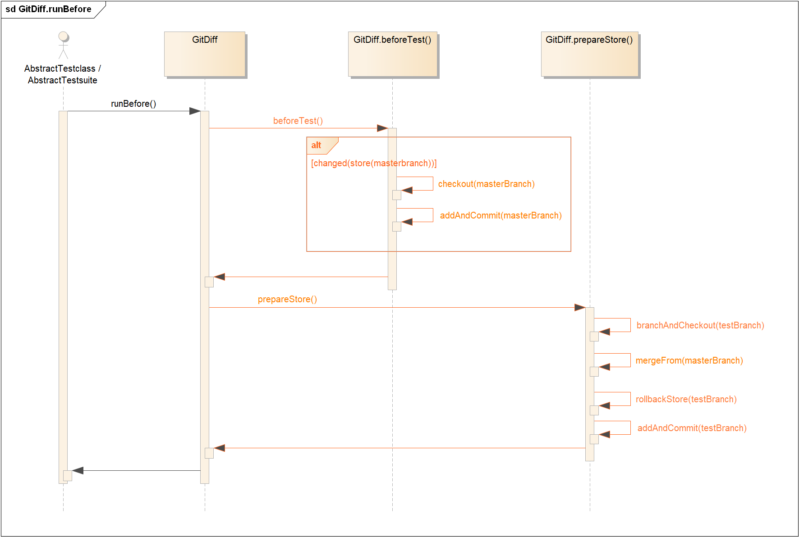
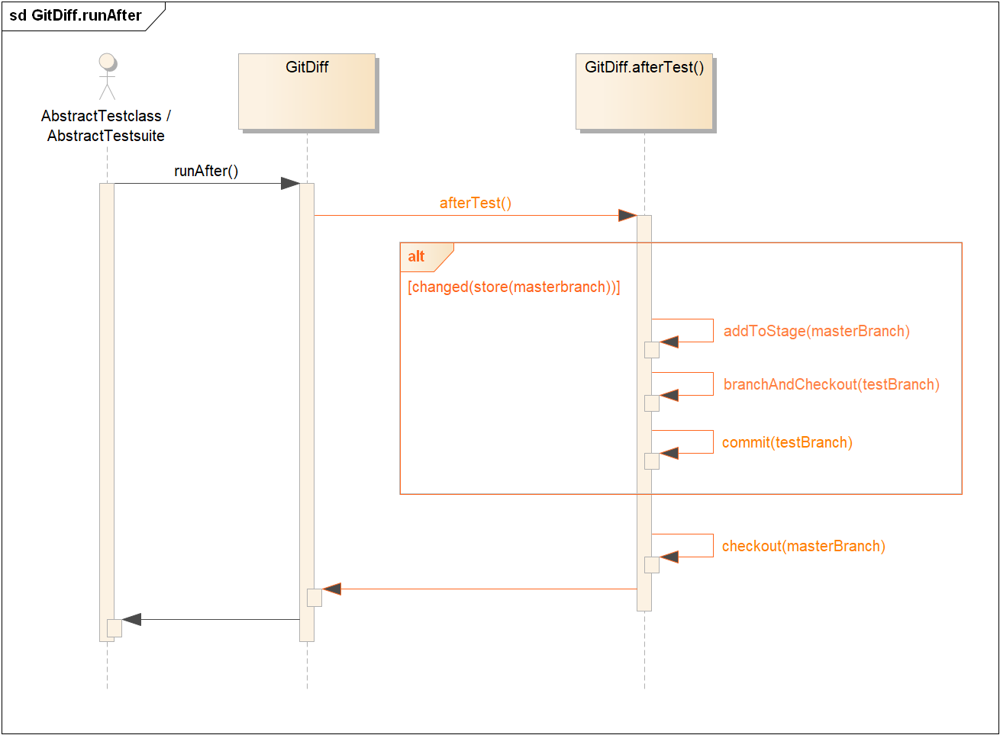

# APIT :: HOW-IT-WORKS
## API Testing Framework
### A Java Framework for Regression Testing of REST APIs
***

### What is at the heart of APIT?

The core of the APIT framework is the comparison of API responses that are created as Testcases. Each Testcase represents a unit test. The framework creates dynamic JUnit tests that are picked up by the JUnit platform for execution.

#### (A) JUnit Dynamic Tests: JSON Comparison
The ```expected``` responses are recorded in the APIT store before the refactoring. Then the tests are run. A test fails if the respective ```expected``` and ```actual``` responses differ from each other. Since API responses are in JSON (JavaScript object notation) format, the responses are compared at JSON level.

* **net.javacrumbs.jsonunit API**  
To compare ```expected``` and ```actual``` API responses as JSON strings.

* **javax.json API**  
As alternative to the above API, JSON strings can be transformed into JSON objects by leveraging the javax.json API. Consequently 2 JSON objects can be compared.

#### (B) GitDiff: A custom-made Diff tool
To further investigate on the actual differences of 2 JSON a git-based diff tool has been designed and implemented in APIT. This diff tool is an optional feature and can be enabled/disabled in the APIT properties before recording and the test run.

#### JUnit Dynamic Tests vs. GitDiff

This timeline visualizes the major difference between the 2 concepts (A) and (B).



The ```expected``` API responses are 'acquired' and stored in the APIT ```/store``` before the test is run.
Each test-run brings 'new' ```actual``` API responses that overwrite the 'old' ```actual``` responses in the APIT ```/store```. Then the JUnit test compares ```actual``` with ```expected``` and fails when they differ. GitDiff on the other hand compares the ```actual``` of test(i) over time. For each test-run, when ```actual```  of test(i) differ from the ```actual``` the previous test(i) has run, a commit is made to the test-branch after that test-run.

***

### Framework Structure

#### 1. APIT Testclasses

<br>
**Example: TestclassTest.java**

```
public class TestclassTest extends AbstractTestclass {

    private static final String testclass = "./src/test/resources/apit/testclasses/realmsRolesUsers.testclass.yml";

    private static final String name = new Object() {}.getClass().getEnclosingClass().getSimpleName();

    @BeforeAll
    public static void beforeAll() {
        before(name, testclass);
    }

    @Tag("APIT")
    @TestFactory()
    public List<DynamicTest> run() {
        return generateTests(name, testclass);
    }

    @AfterAll
    public static void afterAll() {
        after();
    }

}
```

<br>
**1.1 Testclass.beforeAll()** : Sequence Diagram  
In ```TestGenerator.prepare(testclass)``` the ```/store``` is prepared.  
In case the GitDiff tool is enabled in the ```apit.properties``` file, the before part of GitDiff: ```GitDiff.runBefore()``` is run (blue color).




<br>
**1.2 Testclass.run()** : Sequence Diagram  
The JUnit Dynamic Tests are generated by the ```@TestFactory run()``` method, picked up by the JUnit 5 Platform and then executed by JUnit 5.
A single dynamic test fails, if ```expected``` API response differs from ```actual``` response.



<br>
**1.3 Testclass.afterAll()** : Sequence Diagram  
If the GitDiff tool is enabled in the ```apit.properties``` file, the after part of GitDiff: ```GitDiff.runAfter()``` is run (blue color).



<br>
#### 2. APIT Testsuites
<br>
**Example: TestsuiteTest.java**
```
public class TestsuiteTest extends AbstractTestsuite {

    private static final List<String> before = Arrays.asList(new String[] {
            "./src/test/resources/apit/scripts/before.bat"
    });
    private static final List<String> testclasses = Arrays.asList(new String[] {
            "./src/test/resources/apit/testclasses/realms.testclass.yml",
            "./src/test/resources/apit/testclasses/roles.testclass.yml",
            "./src/test/resources/apit/testclasses/users.testclass.yml",
    });
    private static final List<String> after = Arrays.asList(new String[] {
            "./src/test/resources/apit/scripts/after.bat"
    });

    private static final String name = new Object() {}.getClass().getEnclosingClass().getSimpleName();


    @BeforeAll
    public static void beforeAll() {
        before(name, before, testclasses);
    }

    @Tag("APIT")
    @TestFactory()
    public List<DynamicTest> run() {
        return generateTests(name, testclasses);
    }

    @AfterAll
    public static void afterAll() {
        after(after);
    }

}
```
<br>
**2.1 Testsuite.beforeAll()** : Sequence Diagram  
Identical to *' **1.1 Testclass.beforeAll()** : Sequence Diagram'* but with a minor twist.  
The scripts that are expected to run before the Testsuite: ```ScriptExecutor.runBatch(beforeScriptList)``` are executed first (blue color).



<br>
**2.2 Testsuite.run()** : Sequence Diagram  
Identical to *' **1.2 Testclass.run()** : Sequence Diagram'* .  

> It is worthwhile to mention that a Testclass runs 1 testclass ```.yml``` file.  
This is in contrast to a Testsuite that typically has 1 to n testclass ```.yml``` files to run.



<br>
**2.3 Testsuite.afterAll()** : Sequence Diagram  
Identical to *' **1.3 Testclass.afterAll()** : Sequence Diagram'* but with a minor twist.  
The scripts that are expected to run after the Testsuite: ```ScriptExecutor.runBatch(afterScriptList)``` are executed last (blue color).



***

### APIT Core Features

<br>
#### (A) JSON Comparison (JUnit Dynamic Tests)

<br>
**JSON Comparison** : Sequence Diagram  
Remember that 1 to n Testcases are specified in a Testclass ```.yml``` file.  
The logic behind **'assertResponseBody'** and **'assertResponseStatus'** of each Testcase is responsible for triggering
* the Json comparison of response body by leveraging the ```net.javacrumbs.jsonunit.JsonAssert API```
* the value comparision of response status by leveraging the ```org.junit.Assert API```  



<br>
#### (B) GitDiff
<br>
**GitDiff.runBefore()** : Sequence Diagram  

**beforeTest()**  
  * If the ```/store``` in the master-branch has changed,
    * add these changes to the stage - ```git add```
    * and committed to the master-branch - ```git commit```  


**prepareStore()**
  * checking out to the test-branch - ```git checkout```
    * merging any chances from the master-branch into the test-branch - ```git merge master-branch```
    * copying ```expected``` API responses into ```actual``` API responses
    * committing any changes to test-branch - ```git commit```
  * checkout to master-branch - ```git checkout master-branch```



<br>
**GitDiff.runAfter()** : Sequence Diagram  

**afterTest()**
  * (still on master-branch)
  * If the ```/store``` on the master-branch has changed,
    * add these changes to the stage - ```git add```
    * checkout to the test-branch - ```git checkout```
    * committing all changes to test-branch - ```git commit```
  * checkout to master-branch


