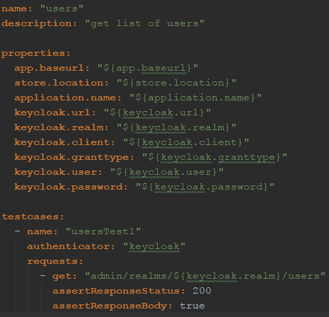

# APIT_same-response-as_keycloak
## Using custom-made framework APIT to assert actual against expected Json responses
#### applied on the Admin API of a Keycloak authentication server

***
*This repository in a series of similar repositories for API testing intended for a specific workflow that compares expected against actual API responses*

### Developers
* [Abuscom GmbH](https://www.github.com/abuscom)
* [raketensilo](https://www.github.com/raketensilo)

### (I) The problem

The following are typical workflows for API development and testing

* **Regression testing of an existing API or backend**
* **Development of a new API**
* **Integration testing at API-level**

For more details about the problem please go to repository [`restassured_same-response-as_keycloak`](https://github.com/raketensilo/restassured_same-response-as_keycloak)

### (II) A solution attempt with APIT
Using
* `JUnit 5 Dynamic Tests`
* `JsonUnit` to compare Json responses and the
* `Keycloak Admin API` in combination with `Docker` as a REST API for testing

### (III) How to get started
* IntelliJ IDEA is the recommended Java IDE
* `.idea/runConfigurations` contains some Run Configuration examples and maven configurations that you can immediately use after you have imported via `File > New > Project from Existing Sources...` in IDEA.
* For testing you can quickly spin-up 1 or 2 docker containers (each container a Keycloak auth server) by using the docker files in the `docker` folder und following the instructions of this [keycloak_full-export](https://github.com/raketensilo/keycloak_full-export) repository.

### (IV) Usage instructions
#### 1. Test example

#### 2. Run group of tests against kc1 (Keycloak 1) to record expected responses

#### 3. Re-run group of tests against kc2 to compare actual and expected response

